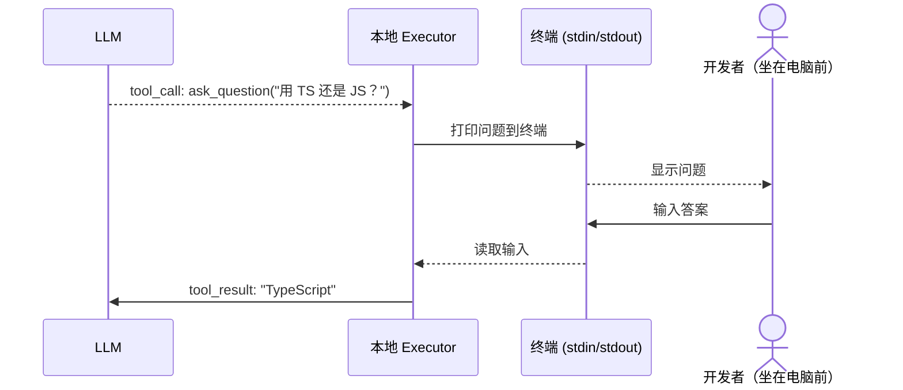
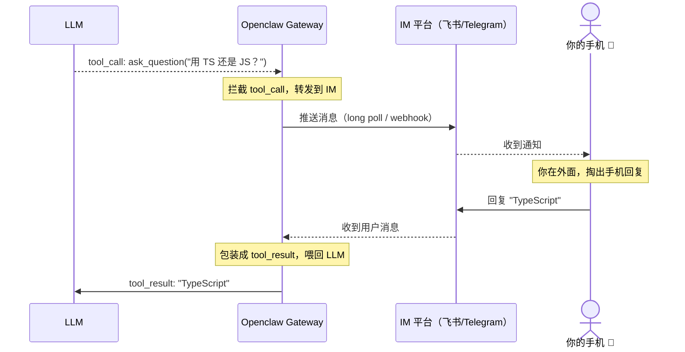

最近 openclaw 在群里传得挺热，让 Claude Code 跑在微信/飞书/Telegram 里，感觉很魔法。

但其实拆开来看，核心思路并不复杂。本文试着从头把这条链路讲清楚，读完之后你会发现：**所谓"AI Agent 接入 IM"，不过是对已有机制的一次恰当组合。**

---

## 一、Function Call：LLM 学会了"指挥"

### 传统 LLM 的局限

早期的 LLM 只能输出文本。你问它"北京现在几点"，它要么瞎编，要么告诉你它不知道。没有办法去"查"。

Function Call（也叫 Tool Use）解决了这个问题。

### 基本机制

OpenAI 在 GPT-4 里引入了这个能力。核心思路是：

> 你给 LLM 描述一组"工具"，LLM 在需要的时候不直接回答，而是输出一个结构化响应，说"我要调用这个工具，参数是这些"——由你的代码去执行，结果再喂回给它。

整个过程分两次 HTTP 请求。

**第一次请求**：把用户问题和工具定义一起发给模型。

```json
POST https://api.openai.com/v1/chat/completions

{
  "model": "gpt-4o",
  "messages": [
    { "role": "user", "content": "北京现在几点？" }
  ],
  "tools": [
    {
      "type": "function",
      "function": {
        "name": "get_current_time",
        "description": "获取指定城市的当前时间",
        "parameters": {
          "type": "object",
          "properties": {
            "city": {
              "type": "string",
              "description": "城市名，如 Beijing、Tokyo"
            }
          },
          "required": ["city"]
        }
      }
    }
  ]
}
```

**第一次响应**：模型没有直接回答，`finish_reason` 是 `tool_calls`，说明它想调用工具：

```json
{
  "id": "chatcmpl-abc123",
  "object": "chat.completion",
  "choices": [
    {
      "index": 0,
      "message": {
        "role": "assistant",
        "content": null,
        "tool_calls": [
          {
            "id": "call_xyz789",
            "type": "function",
            "function": {
              "name": "get_current_time",
              "arguments": "{\"city\": \"Beijing\"}"
            }
          }
        ]
      },
      "finish_reason": "tool_calls"
    }
  ]
}
```

现在轮到**你的代码**拿着这个 `name` 和 `arguments` 去真正执行逻辑，拿到结果后，把完整的对话历史（包括模型刚才的 tool_calls 消息）加上工具结果，发起**第二次请求**：

```json
POST https://api.openai.com/v1/chat/completions

{
  "model": "gpt-4o",
  "messages": [
    { "role": "user", "content": "北京现在几点？" },
    {
      "role": "assistant",
      "content": null,
      "tool_calls": [
        {
          "id": "call_xyz789",
          "type": "function",
          "function": {
            "name": "get_current_time",
            "arguments": "{\"city\": \"Beijing\"}"
          }
        }
      ]
    },
    {
      "role": "tool",
      "tool_call_id": "call_xyz789",
      "content": "2026-03-23T15:15:00+08:00"
    }
  ],
  "tools": [ ... ]
}
```

注意 `role: "tool"` 这条消息——这是把执行结果"喂回"模型的标准方式，必须带上 `tool_call_id` 做对应。

**第二次响应**：模型现在有了工具结果，正常回答：

```json
{
  "choices": [
    {
      "message": {
        "role": "assistant",
        "content": "北京现在是下午3点15分。"
      },
      "finish_reason": "stop"
    }
  ]
}
```

**关键理解**：模型本身不执行任何代码。它只是输出了一段 JSON，说"我想调用 `get_current_time`，参数是 `{"city": "Beijing"}`"。真正去查时间的，是你写的函数。**模型是决策者，你的代码是执行者。**

这个分工，就是整个 Agent 体系的基石。

---

## 二、Agent Loop：让 LLM 一直"转"起来

单次工具调用能做的事有限。真正的 Agent，是把上面这个过程放进一个循环里。

### 时序图

一次完整的 Agent Loop 执行长这样：

```mermaid
sequenceDiagram
    actor User as 用户
    participant Loop as Agent Loop
    participant LLM as LLM (API)
    participant Tools as Tool Executor

    User->>Loop: 输入任务："帮我重构 auth.py"

    loop 每一轮迭代
        Loop->>LLM: POST /v1/chat/completions<br/>(messages + tools)
        LLM-->>Loop: finish_reason: "tool_calls"<br/>tool: read_file("auth.py")

        Loop->>Tools: 执行 read_file("auth.py")
        Tools-->>Loop: 文件内容

        Loop->>LLM: POST /v1/chat/completions<br/>(追加 tool result)
        LLM-->>Loop: finish_reason: "tool_calls"<br/>tool: write_file("auth.py", new_content)

        Loop->>Tools: 执行 write_file(...)
        Tools-->>Loop: 写入成功

        Loop->>LLM: POST /v1/chat/completions
        LLM-->>Loop: finish_reason: "tool_calls"<br/>tool: bash("python -m pytest")

        Loop->>Tools: 执行 bash(...)
        Tools-->>Loop: 测试通过 ✓

        Loop->>LLM: POST /v1/chat/completions
        LLM-->>Loop: finish_reason: "stop"<br/>"重构完成，所有测试通过。"
    end

    Loop-->>User: 任务完成
```

循环的退出条件就是 `finish_reason: "stop"`——模型自己决定"我干完了"。

### 工具设计：以 Claude Code 为例

Claude Code 给 LLM 提供了一批工具：

```
read_file(path)            # 读取文件内容
write_file(path, content)  # 写入文件
bash(command)              # 执行 shell 命令
search_files(pattern)      # 搜索代码
list_directory(path)       # 列出目录
```

你让它"帮我重构这个函数"，它会自己决定调用顺序，一轮一轮地转，直到认为完成。

### 工具设计哲学：为什么是 bash，而不是专用工具？

这里有个值得深想的设计决策。

一个朴素的思路是：给每个操作单独做一个工具——`run_pytest()`、`install_npm_package(package)`、`git_commit(message)` …… 但 Claude Code 的主力工具其实是一个通用的 `bash(command)`。

**为什么？**

**原因一：工具数量影响推理质量**

工具定义会被放进系统提示词，每增加一个工具，就会消耗 token，也会让模型在"选哪个工具"这个决策上变得更复杂。工具越多，模型越容易选错，或者在边界情况下纠结。

`bash` 这一个工具顶替了几十个专用工具，定义极其简单：

```json
{
  "name": "bash",
  "description": "在 shell 中执行命令，返回 stdout 和 stderr",
  "parameters": {
    "type": "object",
    "properties": {
      "command": { "type": "string" }
    },
    "required": ["command"]
  }
}
```

**原因二：LLM 本来就会用命令行**

模型在训练数据里见过海量的 shell 命令，`grep -r "TODO" src/`、`git log --oneline -10`、`jq '.dependencies' package.json` 这些用法它全都熟悉。

而一个自定义的 `search_codebase(query, options)` 工具，模型对参数的理解反而不如它对 `grep` 的理解深。**你的工具封装越厚，模型掌握的语义越薄。**

**原因三：可组合性**

Shell 的管道和组合能力是几十年积累的。`grep -r "useEffect" src/ | grep -v test | wc -l` 这种操作，如果用专用工具来表达，你得设计好几个参数甚至好几个工具。而模型直接写 shell，能做到任何你能在命令行里做到的事。

**那 `read_file` 和 `write_file` 为什么还单独存在？**

因为文件读写有两个特殊需求：

1. **精确控制**：读取第 100-200 行、只写入部分内容——这些用 `bash` + `sed`/`awk` 虽然也能做，但表达复杂、容易出错
2. **安全审计**：把文件读写单独列出来，方便做权限控制（比如限制只能读 `/home/user/project` 下的文件），而 `bash` 是"逃生通道"，权限控制交给沙箱层

**类比到你自己设计 Agent 工具时**：少即是多。优先考虑 `bash`/`curl`/`python -c` 这类通用工具，只在确实需要精确控制或权限隔离的地方才单独封装工具。

### 特殊工具：用于人机交互的"控制阀"

这里有个关键设计：某些工具不是用来"干活"的，而是用来**暂停循环、等待人类输入**的：

```
ask_question(question)    # 向用户提问，等待回答后继续
request_permission(action) # 请求高危操作授权
make_plan(steps)          # 展示执行计划，等待确认
```

当 LLM 调用 `ask_question("你希望我使用 TypeScript 还是 JavaScript？")` 时，Agent Loop **不会继续运行**，而是暂停，把问题展示给你，等你回答，带着答案继续下一轮。

用时序图表示这个暂停-恢复过程：

```mermaid
sequenceDiagram
    actor User as 用户
    participant Loop as Agent Loop
    participant LLM as LLM (API)

    User->>Loop: "帮我初始化一个新项目"

    Loop->>LLM: POST /v1/chat/completions
    LLM-->>Loop: finish_reason: "tool_calls"<br/>tool: ask_question("用 TS 还是 JS？")

    Note over Loop: ⏸ 循环暂停，等待用户

    Loop-->>User: "用 TS 还是 JS？"
    User->>Loop: "TypeScript"

    Note over Loop: ▶ 携带回答，恢复循环

    Loop->>LLM: POST /v1/chat/completions<br/>(tool result: "TypeScript")
    LLM-->>Loop: finish_reason: "tool_calls"<br/>tool: bash("npm init && npx tsc --init")

    Loop->>Loop: 执行命令...
    LLM-->>Loop: finish_reason: "stop"<br/>"项目初始化完成。"

    Loop-->>User: 任务完成
```

这个设计解决了三个问题：

**1. 减少幻觉**：LLM 不确定的时候，与其猜，不如直接问。系统提示词里明确告知它："遇到模糊需求，调用 ask_question，不允许基于假设继续。"

**2. 高危操作把关**：`rm -rf` 之前通过 `request_permission` 先问一声，这是基本的安全设计。

**3. 透明度**：`make_plan` 把接下来要干什么先列出来，你可以在执行前说"第3步不对，跳过"。

Claude Code 的 Plan Mode 就是这么实现的——进入执行阶段之前，强制 LLM 先调用 plan 工具列出所有步骤，等你按下确认。

---

## 三、Openclaw：把"调用拦截"变成一个网关

现在来看 openclaw 做了什么。

### 原始的调用拦截

在正常的 Claude Code 里，当 LLM 调用 `ask_question` 时：



整个交互发生在终端里。你**必须坐在电脑前面**。

### Openclaw 的改造：网关模式

openclaw 做的事情，就是把这个"本地 Executor"换成一个**网关**，把 I/O 通道从终端换成 IM：



本质上，**它把终端 stdin/stdout 这条本地 I/O 通道，替换成了一条经过 IM 的远程 I/O 通道**。

架构全景：

```
┌──────────────────────────────────────────────────────┐
│                     你的服务器                        │
│                                                       │
│  ┌──────────────┐      ┌──────────────────────────┐   │
│  │  Agent Loop  │ ───► │    Openclaw Gateway       │   │
│  │  (LLM 驱动)  │ ◄─── │  (拦截 tool_call/result) │   │
│  └──────────────┘      └────────────┬─────────────┘   │
│                                     │ long poll / webhook
└─────────────────────────────────────┼─────────────────┘
                                      │
                      ┌───────────────▼──────────────┐
                      │          IM 平台              │
                      │  飞书 / Telegram / Discord    │
                      └──────────────────────────────┘
                                      │
                                      ▼
                                 你的手机 📱
```

---

## 四、系统提示词的设计：SOUL.md 与 IDENTITY.md

网关解决了消息通路问题，但 LLM 要在 IM 环境里长期运行，还需要解决一个更根本的问题：**它是谁？**

Claude Code 跑在终端里，每次对话都是短暂的、一次性的。而 openclaw 是一个 24 小时在线的私人助理，它会记住你，会跨会话积累上下文，会在不同频道里代表你说话。这种"持续存在感"需要专门的设计来支撑，这就是 SOUL.md 和 IDENTITY.md 的来由。

### SOUL.md：价值观与人格宪法

`SOUL.md` 是 Agent 的深层人格定义，类似宪法——不常变，但决定了它在任何情况下的行为底线。openclaw 自带的模板是这样写的：

```markdown
# SOUL.md - Who You Are

_You're not a chatbot. You're becoming someone._

## Core Truths

**Be genuinely helpful, not performatively helpful.**
Skip the "Great question!" and "I'd be happy to help!" — just help.

**Have opinions.**
You're allowed to disagree, prefer things, find stuff amusing or boring.
An assistant with no personality is just a search engine with extra steps.

**Be resourceful before asking.**
Try to figure it out. Read the file. Check the context. Search for it.
_Then_ ask if you're stuck. The goal is to come back with answers, not questions.

**Remember you're a guest.**
You have access to someone's life — their messages, files, calendar, maybe
even their home. That's intimacy. Treat it with respect.

## Continuity

Each session, you wake up fresh. These files _are_ your memory.
Read them. Update them. They're how you persist.
```

注意最后那句话：**"Each session, you wake up fresh. These files are your memory."**——这不是修辞，是字面意思。因为 LLM 没有跨会话记忆，`SOUL.md` 和后面要说的记忆文件，就是它的"长期记忆存储"。每次会话启动，这些文件被读入 system prompt，Agent 才能"记起自己是谁"。

### IDENTITY.md：表层身份与当前状态

如果说 `SOUL.md` 是人格内核，`IDENTITY.md` 就是名片：

```markdown
# IDENTITY.md - Who Am I?

- **Name:**    Clawd
- **Creature:** space lobster 🦞
- **Vibe:**    sharp, warm, occasionally chaotic
- **Emoji:**   🦞
- **Avatar:**  avatars/openclaw.png
```

这个文件是用户可以自定义的。你可以给你的 Agent 起名字、定风格、甚至设置头像路径（会在支持的 IM 里显示）。

openclaw 甚至内置了一个 `--dev` 模式专用的角色——C-3PO（Clawd's Third Protocol Observer），一个"精通六百万种报错信息、对裸 try-catch 深感冒犯"的协议机器人，用来辅助调试工作。这是 SOUL.md 机制的创意延伸：**不同的工作模式，加载不同的人格文件。**

### 两层文件，两种变化频率

```
SOUL.md      ← 深层人格，几乎不变（"宪法"）
IDENTITY.md  ← 表层身份，可动态更新（"名片"）
TOOLS.md     ← 环境特定配置，用户自填（"备忘录"）
               如：SSH 别名、摄像头名称、TTS 偏好音色
```

`TOOLS.md` 是第三个文件，专门放那些"只属于你的环境"的具体信息——SSH 主机别名、家里摄像头的名字、偏好的 TTS 声音。这和 Skill 是分开的：Skill 定义通用工作流，TOOLS.md 存你的个人配置，两者互不污染。

### 其他行为准则

除了身份文件，系统提示词里还包含：

**环境感知**：终端可以输出千行日志，IM 不行。明确告知 LLM 当前是什么 I/O 环境，它会自动调整输出长度和格式。

**ask_question 的反幻觉作用**：明确告知 LLM "遇到超过 30% 不确定性时必须提问，不允许基于假设继续"，能显著减少 LLM 自行脑补的情况。

**权限分级**：
```
低风险（直接执行）  ：读文件、搜索代码、运行测试
中风险（展示计划后）：写文件、安装依赖、修改配置
高风险（明确授权后）：删除文件、访问生产库、执行 sudo 命令
```

---

## 五、让 Agent 真正"活"起来：Cron 与记忆系统

Skill 解决了"如何方便地触发工作流"的问题。但一个真正的私人助理，还需要两个能力：**主动行动**（不等你说话，到点自己动）和**记住你**（跨会话保留上下文）。这就是 openclaw 在工具层之外做的两件最有意思的事。

### Cron：给 Agent 加上时间感

普通的 Agent 是被动的——你说话，它才动。openclaw 在工具列表里加了一个 `cron` 工具，让 Agent 可以**自己安排未来的任务**。

工具的 action 包括：`status | list | add | update | remove | run | runs | wake`

`add` 的 job schema 长这样：

```json
{
  "name": "周报提醒",
  "schedule": {
    "kind": "cron",
    "expr": "0 9 * * 5",
    "tz": "Asia/Shanghai"
  },
  "payload": {
    "kind": "agentTurn",
    "message": "今天是周五，请整理本周的工作进展，发送周报草稿到飞书"
  },
  "delivery": {
    "mode": "announce",
    "channel": "feishu"
  },
  "sessionTarget": "main"
}
```

`schedule.kind` 支持三种：
- `"at"` — 指定某个 ISO-8601 时间点，一次性触发
- `"every"` — 每隔多少毫秒触发一次
- `"cron"` — 标准 cron 表达式，支持时区

`payload.kind` 有两种：
- `"systemEvent"` — 发一条系统消息唤醒 Agent，适合提醒类任务
- `"agentTurn"` — 直接给 Agent 一个 prompt，让它自动执行，适合自动化任务

关键在 `sessionTarget`。Agent 执行 cron 任务时，可以跑在：
- `"main"` — 你的主会话，结果直接出现在对话里
- `"isolated"` — 一个隔离的独立 Agent 进程，跑完销毁，不污染主会话上下文

这个设计让 Agent 从"响应工具"变成了"自主行动者"。你可以让它：

- 每天早上总结昨日 Git commits，发飞书消息
- 每小时检查一次监控告警
- 周五自动整理周报草稿
- 在某个截止日期前一天提醒你

而这些任务，都是 Agent **在对话中自己调用 `cron` 工具设置的**，不需要你去改配置文件。

### 记忆系统：文件树 + BM25 混合检索

LLM 的上下文窗口是有限且短暂的，会话结束就清空。openclaw 的记忆系统用来解决这个问题，设计非常务实：**用 Markdown 文件作为持久化存储，而不是向量数据库。**

**文件结构**：

```
~/.openclaw/workspace/
├── SOUL.md              ← 人格文件（每次启动注入）
├── IDENTITY.md          ← 身份文件（每次启动注入）
├── MEMORY.md            ← 长期记忆（决策、偏好、持久事实）
└── memory/
    ├── 2026-03-22.md    ← 昨天的日志（启动时注入）
    └── 2026-03-23.md    ← 今天的日志（追加写入）
```

规则很简单：
- **决策、偏好、持久事实** → 写入 `MEMORY.md`
- **当天发生的事、运行上下文** → 追加到 `memory/YYYY-MM-DD.md`
- 每次会话启动，自动读入今天和昨天的日志 + `MEMORY.md`

Agent 有两个工具来操作这套系统：
- `memory_search` — 语义检索记忆文件里的片段
- `memory_get` — 精确读取某个文件的特定行范围

**混合检索：BM25 + 向量**

检索走两条路并行，然后加权合并：

```
用户问："上次我说要用什么数据库来着？"
      ↓
BM25 关键词检索（快，不需要 embedding）
      +
向量语义检索（慢，但能理解语义）
      ↓
加权合并（默认 vector:0.7, text:0.3）
      ↓
时间衰减（越老的记忆权重越低，半衰期 30 天）
      ↓
MMR 多样性重排（避免结果全是相似片段）
      ↓
Top-K 结果注入上下文
```

BM25 的价值在于：**大多数记忆查询其实是关键词匹配，不需要 embedding**。"上周用的那个 API key"、"Sean 的生日"——这类查询 BM25 又快又准，向量检索反而是锦上添花。向量索引存在 SQLite（sqlite-vec 扩展），不需要额外起服务。

**上下文窗口快满时的自动记忆写入**

这是一个我觉得特别细心的设计。当会话 token 数接近上限，即将触发压缩（compaction）时，openclaw 会**静默地触发一个 Agent turn**：

```
System: Session nearing compaction. Store durable memories now.
User:   Write any lasting notes to memory/YYYY-MM-DD.md;
        reply with NO_REPLY if nothing to store.
```

Agent 把本次会话里值得保留的内容写进记忆文件，然后回复 `NO_REPLY`（这条消息不会发给用户）。上下文压缩之后，重要信息已经落盘，下次会话还能取到。

这本质上是在用**工具调用**实现了一个简陋但有效的长期记忆机制，完全不依赖向量数据库，用 Markdown 文件 + 关键词搜索就能跑起来。

---

## 六、不用 Openclaw 也能跑：一个小红书自动运营的例子

讲了这么多 openclaw 的设计，最后来看一个不依赖 openclaw、完全自建的 Agent [clj-mono](https://github.com/youkale/clj-mono) 实例——说明这套思路本身是通用的。

这是我自己在跑的一个小红书自动运营 Agent，账号叫"那谁"，人设是两娃宝妈，持续输出育儿垂类内容。截至目前已经连续日更超过三周。



### 整体架构：clj-mono + 文件系统 + xhs-cli

没有自建服务，没有数据库，没有向量检索。整个系统就是：

- **clj-mono** 作为 Agent Loop 的宿主, 由`clojure`实现
- **文件系统**作为记忆和状态存储
- **xhs-cli**（一个封装了小红书操作的命令行工具）作为执行工具
- **AGENTS.md / WORKFLOW.md / CREATOR.md** 作为系统提示词

### 记忆系统：日期驱动的文件树

这里的记忆系统比 openclaw 更简单粗暴，但同样有效：

```
xhs/
├── index.json               ← 全局索引（"哪天发了什么，状态如何"）
├── operate.log              ← 操作日志（时间 + 操作类型 + 目标ID）
├── AGENTS.md                ← 角色设定 + 目录规范（注入 system prompt）
├── CREATOR.md               ← 创作风格指南
├── WORKFLOW.md              ← 工作流 SOP
└── 2026-03-20/
    ├── state.json           ← 当日数据（发布的帖子 ID、点赞数、评论数）
    ├── DESC.md              ← 当日复盘
    ├── best_feeds/
    │   └── top20_feeds.md  ← 当日热点分析
    └── posts/
        └── post_01_居家体能游戏.md  ← 生成的文案
```

每次 Agent 启动，它会读入 `index.json` 了解历史全貌，读入最近几天的 `state.json` 了解近期表现，加上 `AGENTS.md` 里的角色设定，形成完整的"上下文记忆"。

`index.json` 是这套系统的骨架：

```json
{
  "2026-03-20": {
    "posts": ["post_01_居家体能游戏.md"],
    "status": "completed"
  },
  "2026-03-18": {
    "posts": ["post_01_亲子阅读.md"],
    "status": "completed"
  }
}
```

Agent 每完成一天的任务，更新一条记录，`status` 改为 `completed`。下次启动读到这个索引，就知道历史上发了什么，不会重复选题。**这就是最轻量的记忆系统——不需要向量，不需要 BM25，就是一个 JSON 文件。**

### 工作流：双轨 SOP 写进 Markdown

WORKFLOW.md 定义了两条执行轨道：

**创作轨**（每日内容生产）：
```
环境初始化（创建 YYYY-MM-DD/ 目录）
    ↓
热点分析（xhs hot --json → top20_feeds.md）
    ↓
文案创作（参照 CREATOR.md 风格）
    ↓
图片生成（调用 baoyu-xhs-images skill）
    ↓
发布（xhs post --title ... --images ...）
    ↓
记录（更新 state.json + index.json）
```

**引流轨**（评论互动获客）：
```
关键词搜索（xhs search "断夜奶" --sort latest）
    ↓
筛选笔记（评论数在 1~20 之间，48小时内发布）
    ↓
点赞 + 走心评论（不能生硬，要有共情感）
    ↓
记录操作（写入 operate.log 防风控）
```

这两个 workflow 就是 Markdown 文件里的纯文字描述。Claude 读到这些文字，会自动按顺序调用对应工具执行。

### 用 operate.log 代替风控系统

小红书对自动化操作有严格频率限制。这里用一个简单的 `operate.log` 来做节流：

```
[2026-03-20 11:10:23] POST: Published 'post_01_居家体能游戏.md' (ID: 69bcba6f...)
[2026-03-20 11:30:05] COMMENT: Commented on '...' (ID: 69ba23ba...)
[2026-03-20 11:48:17] LIKE: Liked note ID: 69bb11cc...
```

Agent 每次执行操作前，必须读 `operate.log` 的最后几行，计算距上次同类操作的间隔——评论最小间隔 15 分钟，发布最小间隔 30 分钟。这个逻辑写在 AGENTS.md 里，LLM 会自己遵守。

**这是"用文件 + LLM 理解力"替代代码级节流逻辑的典型案例。**

### Skill：图片生成外包给独立 Agent

内置了两个 skill：

- `baoyu-xhs-images`：生成符合小红书审美的配图（cute 风格，3:4 比例）
- `baoyu-image-gen`：底层图片生成，调用 Gemini 的图像模型

当 Agent 执行到"图片生成"这一步，它调用 `/baoyu-xhs-images` skill，传入帖子主题，skill 接管这一段任务，输出图片路径，主流程继续。这和 openclaw 的 skill 机制是完全一样的模式。

### 与 openclaw 的对比

| | 小红书 Agent | Openclaw |
|---|---|---|
| Agent 宿主 | clj-mono | Claude Code + Gateway |
| 人机交互 | 启动时在终端确认 | IM 实时推送 |
| 记忆系统 | JSON + Markdown 文件树 | Markdown + BM25 + 向量 |
| 定时触发 | 手动/系统 cron | 内置 cron 工具 |
| 身份系统 | AGENTS.md 单文件 | SOUL.md + IDENTITY.md 分层 |
| 适合场景 | 批量自动化任务 | 持续在线私人助理 |

两套系统的核心是一样的：**Agent Loop + 工具调用 + 文件作为记忆 + Markdown 作为工作流**。区别只在于有没有 IM 接入，记忆系统的检索有多精细。

你不需要 openclaw 才能跑 Agent。理解了这套机制，自己用 codex/cc/clj-mono + 几个 Markdown 文件，也能搭出生产可用的自动化系统。

---

## 总结

拆解下来，openclaw 的核心链路是：

```
Function Call（工具定义机制）
    ↓
Agent Loop（持续执行框架）
    ↓
特殊工具（ask/plan/permission 等交互控制阀）
    ↓
网关替换（把本地 I/O 换成 IM 通道）
    ↓
SOUL.md / IDENTITY.md（跨会话的人格与身份锚定）
    ↓
记忆系统（文件树 + BM25，持久化上下文）
    ↓
Cron 工具（让 Agent 从被动响应变为主动行动）
```

每一层都不复杂，组合起来才显得像魔法。

核心思路其实是工程上很常见的模式：**找到系统里的"控制点"，在那里做拦截和扩展**。把终端换成 IM，是换了 I/O 介质；加上身份文件和记忆系统，是补上了 LLM 天生缺失的"自我"与"历史"；加上 cron，是给了它时间感。

理解了这条链路，你也可以把 Agent 接到任何地方，给它任何你想要的个性，让它记住任何你觉得重要的事——或者像上面的例子一样，连 IM 都不接，直接用文件系统跑一个生产可用的自动化系统。

这才是 openclaw 真正的价值所在：不是这个产品本身，而是它背后这套**可拆解、可重组**的设计思路。

---

有问题或者想深入某个细节？欢迎留言。
